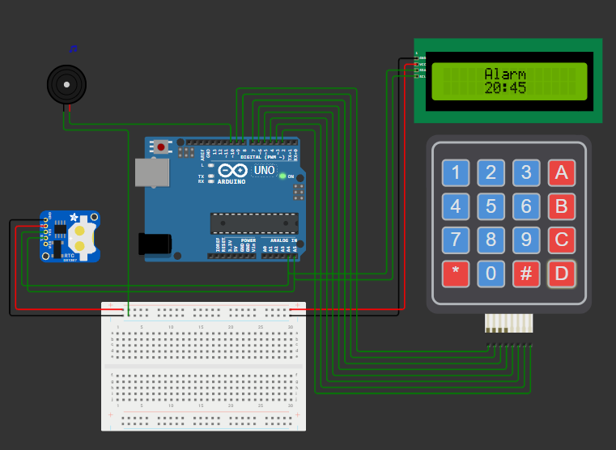

# ⏰ Smart Alarm

**Arduino-based Snooze-Preventing Alarm Clock**

  

    
     <i>Figure 1: Smart Alarm Prototype</i>

---

## Table of Contents 📑

- [Description 📝](#description-)
- [Features ✨](#features-)
- [Components Used 🛠️](#components-used)
- [Working Principle ⚙️](#working-principle)
- [Circuit Diagram 🔌](#circuit-diagram-)
- [Software Requirements 💻](#software-requirements-)
- [Installation & Setup ⚡](#installation--setup-)
- [Applications 🌍](#applications-)
- [Future Improvements 🚀](#future-improvements-)
- [Authors 👤](#authors-)
- [License 📄](#license-)

---

## Description 📝

The **Smart Alarm** is an Arduino-based alarm clock designed to prevent users from snoozing.  
Instead of turning the alarm off with a single button press, the user must **solve three simple math problems** using a keypad.

This approach forces mental engagement, ensuring the user is fully awake before disabling the alarm completely.

---

## Features ✨

- Displays real-time clock on LCD
- Custom alarm time setting via keypad
- Math-based wake-up challenge
- Loud buzzer alert
- Prevents accidental snoozing
- Low-cost and beginner-friendly design

---

<h2 id="components-used">Components Used 🛠️</h2>

| Component      |
| -------------- |
| Arduino UNO    |
| Breadboard     |
| LCD 16x2 (I2C) |
| Keypad 4x4     |
| Buzzer         |
| RTC (DS1307)   |
| Jumper Wires   |

---

<h2 id="working-principle">Working Principle ⚙️</h2>

1. The **DS1307 RTC module** continuously keeps track of the current time.
2. The current time is displayed in real time on the **16x2 I2C LCD**.
3. The user enters **alarm setting mode** by pressing **`A`** on the **4x4 keypad**.
4. Using numeric keys, the user enters the desired **alarm time (hours and minutes)**.
5. The alarm time is saved by pressing **`D`** on the keypad.
6. The system continuously compares the current time with the saved alarm time.
7. When the current time matches the alarm time:
   - The **buzzer starts ringing**.
   - The LCD indicates that the alarm is active.
8. The user can temporarily silence the buzzer by pressing **any keypad key**.
9. The system then displays a **math problem** on the LCD.
10. The user must:
    - Enter the answer using the keypad.
    - Press **`D`** to submit the answer.
11. The user has **15 seconds** to answer each math problem:
    - If the time expires without submission, the **buzzer starts ringing again**.
12. If an **incorrect answer** is submitted:
    - An error message is displayed.
    - The same question is asked again.
    - The 15-second timer resets.
13. After **three correct answers**:
    - The buzzer is permanently stopped.
    - The alarm is disabled until the **next day at the same time**.

This mechanism ensures the user is both physically and mentally awake before the alarm can be fully disabled.

---

## Circuit Diagram 🔌

    
     <i>Figure 2: Smart Alarm Circuit Diagram</i>

---

## Software Requirements 💻

- **Wokwi Simulator** (recommended)  
  https://wokwi.com/
- **Arduino IDE** (required for real hardware)

---

## Installation & Setup ⚡

### ▶️ Using Wokwi (Recommended)

This project was developed and tested using the **Wokwi Arduino Simulator**.

1. Open **Wokwi**: https://wokwi.com/
2. Create a new **Arduino Uno** project.
3. Add the following components:
   - Arduino UNO
   - 16x2 LCD (I2C)
   - 4x4 Matrix Keypad
   - DS1307 RTC
   - Active Buzzer
4. Connect all components according to the **circuit diagram**.
5. Copy the Arduino code into `sketch.ino`.
6. Required libraries are **preinstalled in Wokwi**.
7. Click **Start Simulation**.
8. Use the keypad to set the alarm and test the system.

---

### ▶️ Building the Project in Real Life (Optional)

#### Hardware Required

- Arduino UNO
- 16x2 LCD with I2C module
- 4x4 Matrix Keypad
- DS1307 RTC module (with CR2032 battery)
- Active buzzer
- Breadboard
- Jumper wires
- USB cable
- (Optional) Enclosure

#### Software Setup

1. Install the **Arduino IDE**.
2. Install the following libraries:
   - `RTClib`
   - `LiquidCrystal_I2C`
   - `Keypad`
3. Connect the Arduino to your computer.
4. Assemble the circuit as shown in the diagram.
5. Select the correct **board** and **COM port**.
6. Upload the sketch.
7. Power the device and configure the alarm using the keypad.

⚠️ **Note:**  
The RTC battery ensures time retention when power is disconnected.

---

## Applications 🌍

- Smart alarm clock for students
- Productivity-focused wake-up system
- Embedded systems learning project
- Anti-snooze solution for heavy sleepers

---

## Future Improvements 🚀

- Adjustable math difficulty levels
- Multiple alarm support
- Voice-based wake-up challenges
- Battery backup support

---

## Authors 👤

- **Alden Čamdžić**
- **Samed Šabanović**

---

## License 📄

This project is **open-source** and free to use for **educational purposes**.
